<!-- README.md is generated from README.Rmd. Please edit that file -->

# TPL Theme

## Installation

``` r
if (!require('devtools')) install.packages('devtools')
config <- yaml::read_yaml("https://raw.githubusercontent.com/connorrothschild/tpltheme/master/config.yaml", eval.expr = TRUE)
library(ggplot2)
#library(tpltheme)
devtools::load_all()
```

## Plotting

### Overview

This package creates a standardized formats for plots to be used in
reports created by the Texas Policy Lab. It primarily relies on
`set_tpl_theme`, which allows the user to specify whether the plot theme
should align with a standard plot (`style = "print"`), or one specially
created for plotting geographical data (`style = "Texas"`).

### Fonts

The user is able to specify whether they want to use *Lato* or *Adobe
Caslon Pro* in their figures.

To ensure that these fonts are installed and registered, use
`font_test()`. If fonts are not properly installed, install both fonts
online and then run `font_install()`.

``` r
font_test()
```

    #> [1] "Lato isn't imported and registered. Install the font online and import and register using font_install()."

``` r
font_install()
```

    #> Importing fonts may take a few minutes, depending on the number of fonts and the speed of the system.
    #> Continue? [y/n]

    #> [1] "Lato isn't imported and registered. Install the font online and import and register using font_install()."

### Usage

Load `library(tpltheme)` **after** `library(ggplot2)` and/or
`library(tidyverse)`.

Here are some examples of sample TPL plots with different specifications
for `style` and `font`.

``` r
#library(tidyverse)
#library(tpltheme)
set_tpl_theme(style = "print", font = "adobe")

ggplot(iris, aes(x=Species, y=Sepal.Width, fill=Species)) +
    geom_bar(stat="summary", fun.y="mean", show.legend = FALSE) +
    labs(x="Species", y="Mean Sepal Width (cm)", fill="Species", title="Iris Dataset")
```

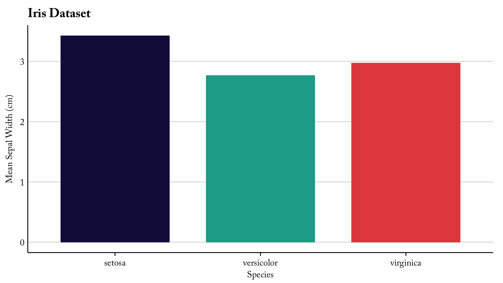<!-- -->

``` r
set_tpl_theme(style = "print", font = "lato")

ggplot(iris, aes(x=jitter(Sepal.Width), y=jitter(Sepal.Length), col=Species, size = Petal.Length)) +
    geom_point() +
    labs(x="Sepal Width (cm)", y="Sepal Length (cm)", col="Species", size = "Petal Length", title="Iris Dataset")
```

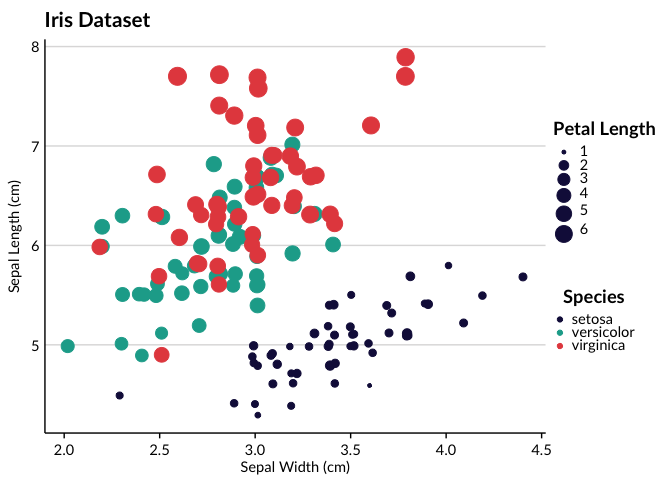<!-- -->

By specifying `style = "Texas"` within `set_tpl_theme`, the user may
also create Texas-specific plots.

``` r
tx_vac <- readr::read_csv("https://raw.githubusercontent.com/connorrothschild/tpltheme/master/data/tx_vac_example.csv")
set_tpl_theme(style = "Texas", font = "adobe")

ggplot2::ggplot(data = tx_vac, mapping = ggplot2::aes(x = long, y = lat, group = group, fill = avgvac*100)) +
  ggplot2::coord_fixed(1.3) +
  scale_fill_continuous(limits = c(78.3,100)) +
  ggplot2::geom_polygon(color = "black") +
  labs(title = "Texas Vaccination Rate by County",
       subtitle = "Among Kindergarteners",
       fill = "Percent\nVaccinated",
       caption = "Source: Texas DSHS")
```

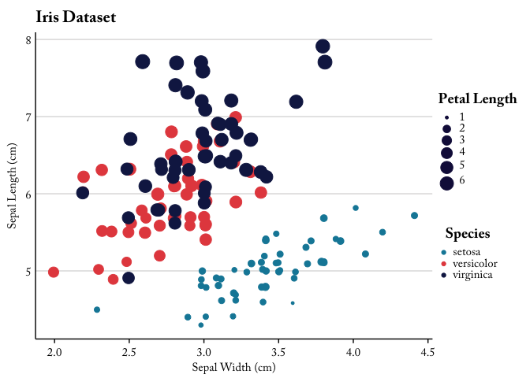<!-- -->

And it also works for categorical variables:

``` r
set_tpl_theme(style = "Texas", font = "lato")

tx_vac %>% 
  dplyr::mutate(cat = factor(dplyr::case_when(avgvac*100 > 99 ~ "Great",
                         avgvac*100 > 90 ~ "Average",
                         avgvac*100 < 90 ~ "Bad"))) %>% 
  ggplot2::ggplot(mapping = ggplot2::aes(x = long, y = lat, group = group, fill = cat)) +
  ggplot2::coord_fixed(1.3) +
  ggplot2::geom_polygon(color = "black") +
  labs(title = "Texas Vaccination Rate by County",
       subtitle = "Among Kindergarteners",
       fill = "Vaccination Rating",
       caption = "Source: Texas DSHS")
```

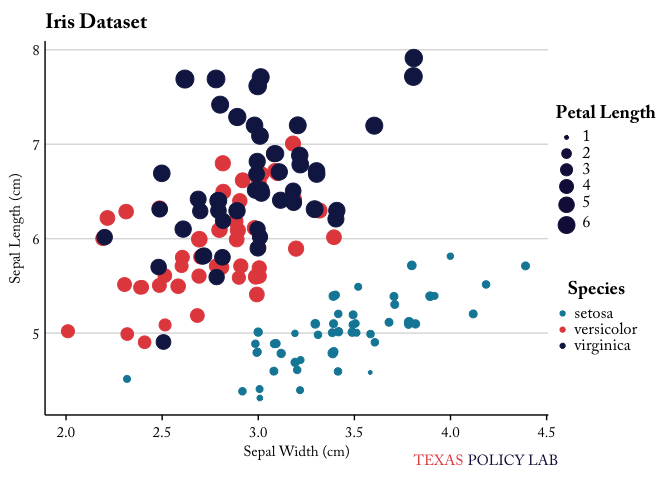<!-- -->

If the number of colors exceeds the number of colors in the TPL palette
(9), the function `tpl_color_pal()` will drop the TPL color palette and
return the greatest number of unique colors possible within the
RColorBrewer’s “Paired” palette (for more information on the use of
RColorBrewer palettes, see [this
chapter](https://bookdown.org/rdpeng/exdata/plotting-and-color-in-r.html#using-the-rcolorbrewer-palettes)).

``` r
tx_vac %>% 
  ggplot2::ggplot(mapping = ggplot2::aes(x = long, y = lat, group = group, fill = subregion)) +
  ggplot2::coord_fixed(1.3) +
  ggplot2::geom_polygon(color = "black", show.legend = FALSE) +
  labs(title = "Texas Counties")
```

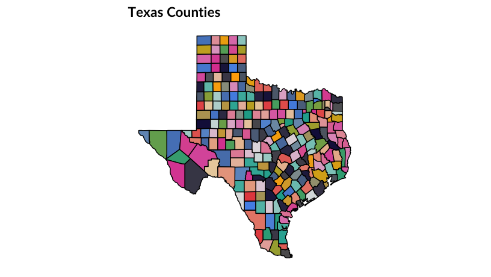<!-- -->

``` r
# default to print afterwards
set_tpl_theme(style = "print")
```

### TPL Branding

#### Logo

The user also has the option to include the TPL logo in single plots.
This may be preferred for those reports being made especially public, or
to serve as a pseudo-watermark in proprietary plots.

``` r
library(grid)
library(gridExtra)
plot <- ggplot(iris, aes(x=jitter(Sepal.Width), y=jitter(Sepal.Length), col=Species, size = Petal.Length)) +
    geom_point() +
    labs(x="Sepal Width (cm)", y="Sepal Length (cm)", col="Species", size = "Petal Length", title="Iris Dataset")
 
add_tpl_logo(plot)
```

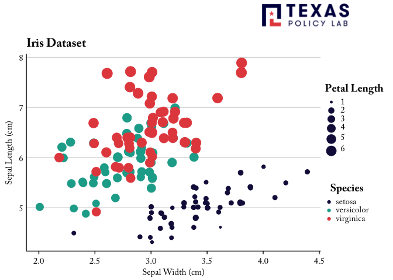<!-- -->

The user can specify the `position` of the logo as well as it’s `size`.
The user is able to move the logo horizontally by specifying `align`.
Positive values will shift the logo rightward while negative values
shift it leftward:

``` r
add_tpl_logo(tpl_plot_test(type = "barplot"), size = "small", position = "bottomright", align = -3)
```

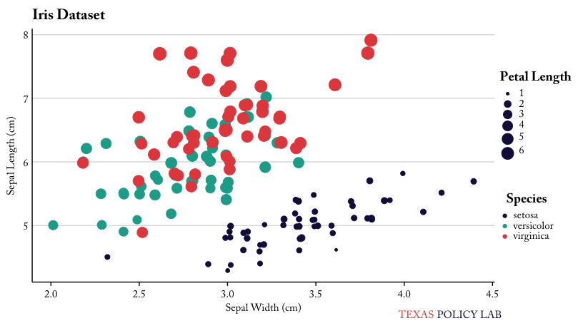<!-- -->

#### Logo Text

There may be some instances when an all-out logo is not warranted or
preferred. If that is the case and the user would still like to
watermark their figures, they can use the function `add_tpl_logo_text()`
to add text to an existing plot object:

``` r
plot <- ggplot(iris, aes(x=jitter(Sepal.Width), y=jitter(Sepal.Length), col=Species, size = Petal.Length)) +
    geom_point() +
    labs(x="Sepal Width (cm)", y="Sepal Length (cm)", col="Species", size = "Petal Length", title="Iris Dataset")
    
add_tpl_logo_text(plot)
```

<!-- -->

The user may also need to specify `align`, which moves the plot
horizontally across the bottom of the page.

``` r
plot <- ggplot(iris, aes(x=Species, y=Sepal.Width, fill=Species)) +
    geom_boxplot(show.legend = FALSE) +
    labs(x="Species", y="Sepal Width (cm)", fill="Species", title="Iris Dataset", subtitle ="When specifying align = 1.5")
    
add_tpl_logo_text(plot, align = 1.5)    
```

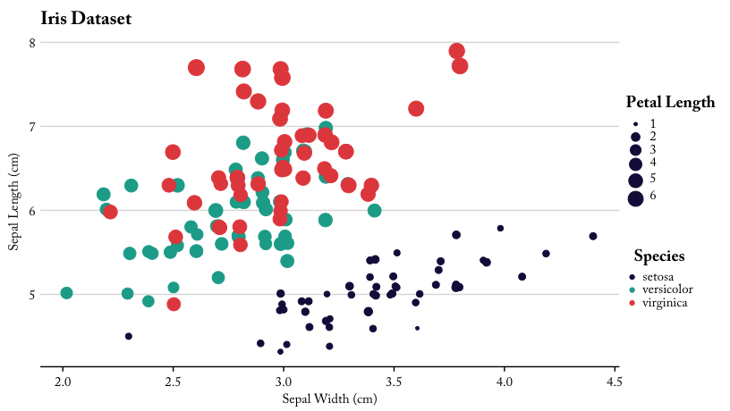<!-- -->

### Additional Functions

#### Drop Axes

In the event that the user wishes to drop an axis, they may do so with
`drop_axis()`. The function may drop any combination of axes depending
on the user’s input (`drop = "x"`, `drop = "y"`, `drop = "both"`, `drop
= "neither"`).

Unlike `add_tpl_logo()`, `drop_axis()` should be *added* to an existing
plot object:

``` r
ggplot(iris, aes(x=jitter(Sepal.Width), y=jitter(Sepal.Length), col=Species, size = Petal.Length)) +
    geom_point() +
    labs(x="Sepal Width (cm)", y="Sepal Length (cm)", col="Species", size = "Petal Length", title="Iris Dataset") +
    drop_axis(axis = "y")
```

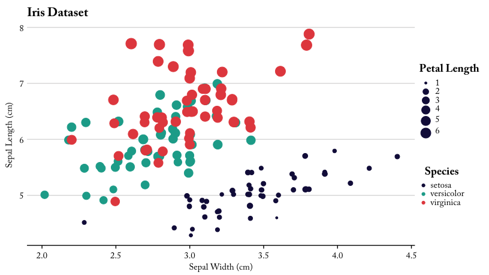<!-- -->

#### Color Palettes

The function `view_palette` plots base color palettes included in
`tplthemes`. All TPL color palettes are led by the notation
`palette_tpl_*` and therefore can be easily autocompleted within
RStudio.

``` r
p1 <- view_palette(palette = palette_tpl_main)
p2 <- view_palette(palette = palette_tpl_diverging)
p3 <- view_palette(palette = palette_tpl_sequential)

grid.arrange(p1, p2, p3, nrow = 1)
```

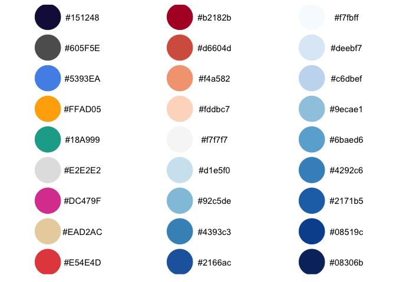<!-- -->

These palettes were created using <http://colorbrewer2.org> and
<http://coloors.co> and are colorblind friendly.

The user may specify the color palette in the `scale_fill_*` or
`scale_color_*` functions in a ggplot call. Specifically, the user can
specify the `palette` (categorical, diverging, sequential) and whether
the palette should be reversed.

``` r
set_tpl_theme(style = "print", font = "lato")
normal <- ggplot(diamonds) +
  geom_bar(aes(x = cut, fill = clarity)) +
  labs(title = "TPL Color Palette",
       subtitle = "On sample data",
       x = "Cut",
       y = "Count",
       fill = "Clarity") +
  theme(axis.text.x = element_text(angle = 45, hjust = 1))

reversed <- ggplot(diamonds) +
  geom_bar(aes(x = cut, fill = clarity)) +
  labs(title = "TPL Color Palette",
       subtitle = "(reversed)",
       x = "Cut",
       y = "Count",
       fill = "Clarity") +
  theme(axis.text.x = element_text(angle = 45, hjust = 1)) +
  scale_fill_discrete(reverse = TRUE)

grid.arrange(normal, reversed, nrow = 1)
```

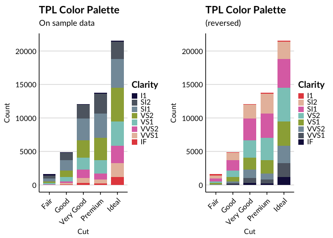<!-- -->

#### Restore Defaults

By calling `undo_tpl_theme`, you are able to remove TPL-specific theme
settings and restores to ggplot defaults.

``` r
undo_tpl_theme()
ggplot(iris, aes(x=jitter(Sepal.Width), y=jitter(Sepal.Length), col=Species, size = Petal.Length)) +
    geom_point() +
    labs(x="Sepal Width (cm)", y="Sepal Length (cm)", col="Species", size = "Petal Length", title="Iris Dataset")
```

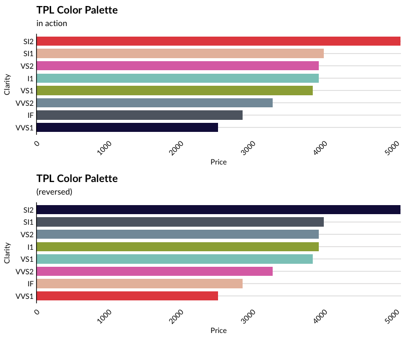<!-- -->

## Reporting

  - `read_word`: Reads word into Rmarkdown, such that word documents can
    be edited and read into the main Rmarkdown file for creating
    reports.
  - `read_word_table`: Reads a table from word into Rmarkdown, such that
    tables in word can be edited and then imported into Rmarkdown.
