<!-- README.md is generated from README.Rmd. Please edit that file -->

TPL Theme
=========

Installation
------------

    if (!require('devtools')) install.packages('devtools')
    library(ggplot2)
    library(tidyverse)

    #devtools::install_github("connorrothschild/tpltheme")
    library(tpltheme)

Plotting
--------

### Overview

This package creates a standardized formats for plots to be used in reports created by the Texas Policy Lab. It primarily relies on `set_tpl_theme`, which allows the user to specify whether the plot theme should align with a standard plot (`style = "print"`), or one specially created for plotting geographical data (`style = "Texas"`).

### Fonts

The user is able to specify whether they want to use *Lato* or *Adobe Caslon Pro* in their figures.

To ensure that these fonts are installed and registered, use `tpl_font_test()`. If fonts are not properly installed, install both fonts online and then run `tpl_font_install()`.

    tpl_font_test()
    tpl_font_install()

### Usage

Load `library(tpltheme)` **after** `library(ggplot2)` and/or `library(tidyverse)`.

Here are some examples of sample TPL plots with different specifications for `style` and `font`.

    set_tpl_theme(style = "print", font = "adobe")

    ggplot(iris, aes(x=Species, y=Sepal.Width, fill=Species)) +
        geom_bar(stat="summary", fun.y="mean", show.legend = FALSE) +
        labs(x="Species", y="Mean Sepal Width (cm)", fill="Species", title="Iris Dataset")

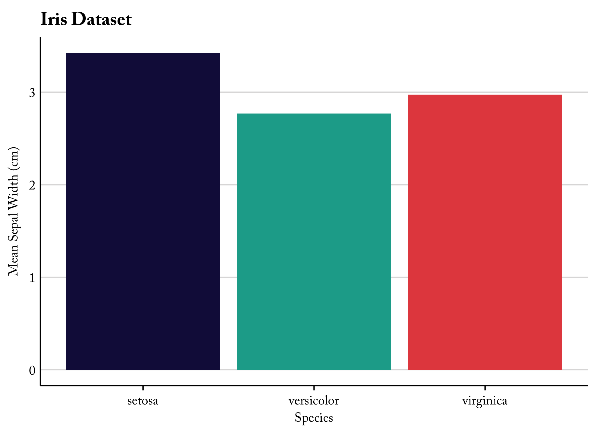

    set_tpl_theme(style = "print", font = "lato")

    ggplot(iris, aes(x=jitter(Sepal.Width), y=jitter(Sepal.Length), col=Species, size = Petal.Length)) +
        geom_point() +
        labs(x="Sepal Width (cm)", y="Sepal Length (cm)", col="Species", size = "Petal Length", title="Iris Dataset")

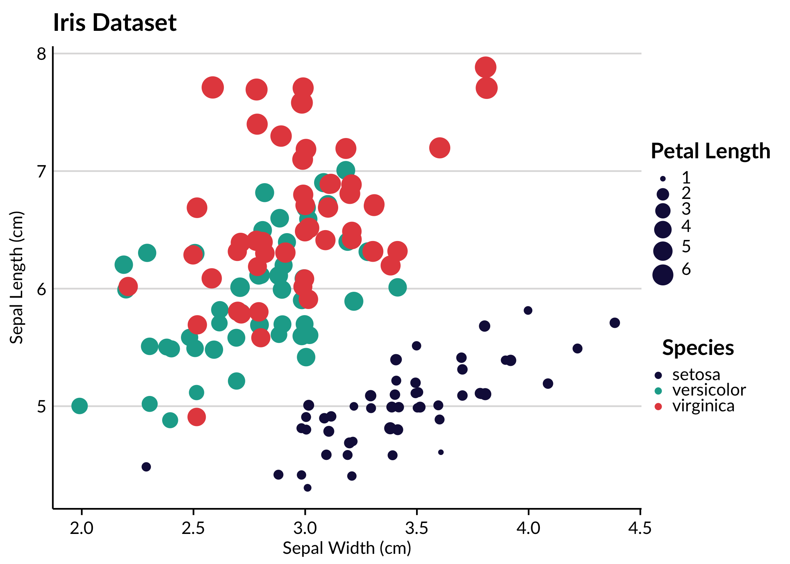

By specifying `style = "Texas"` within `set_tpl_theme`, the user may also create Texas-specific plots.

    tx_vac <- readr::read_csv("https://raw.githubusercontent.com/connorrothschild/tpltheme/master/data/tx_vac_example.csv")
    set_tpl_theme(style = "Texas", font = "adobe")

    ggplot(data = tx_vac, mapping = aes(x = long, y = lat, group = group, fill = avgvac*100)) +
      coord_fixed(1.3) +
      scale_fill_continuous(limits = c(78.3,100)) +
      geom_polygon(color = "black") +
      labs(title = "Texas Vaccination Rate by County",
           subtitle = "Among Kindergarteners",
           fill = "Percent\nVaccinated",
           caption = "Source: Texas DSHS")

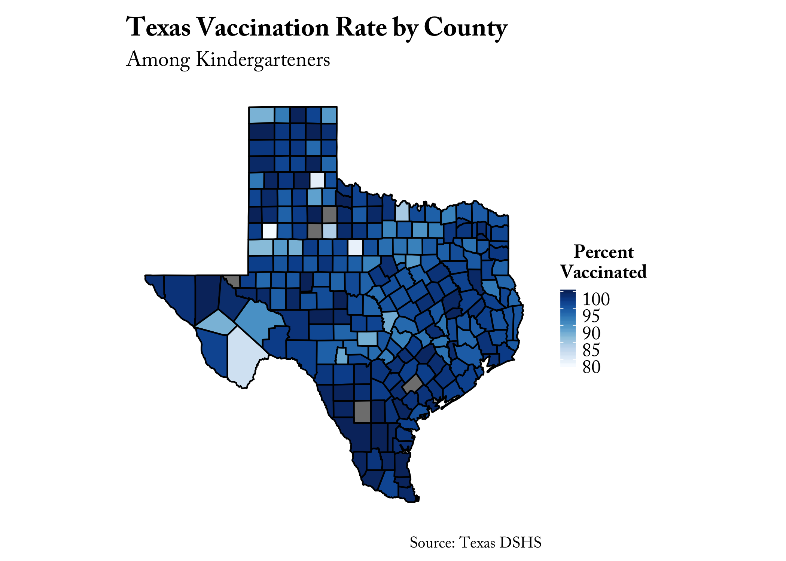

And it also works for categorical variables:

    set_tpl_theme(style = "Texas", font = "lato")

    tx_vac %>% 
      dplyr::mutate(cat = factor(dplyr::case_when(avgvac*100 > 99 ~ "Great",
                             avgvac*100 > 90 ~ "Average",
                             avgvac*100 < 90 ~ "Bad"))) %>% 
      ggplot(mapping = aes(x = long, y = lat, group = group, fill = cat)) +
      coord_fixed(1.3) +
      geom_polygon(color = "black") +
      labs(title = "Texas Vaccination Rate by County",
           subtitle = "Among Kindergarteners",
           fill = "Vaccination Rating",
           caption = "Source: Texas DSHS")

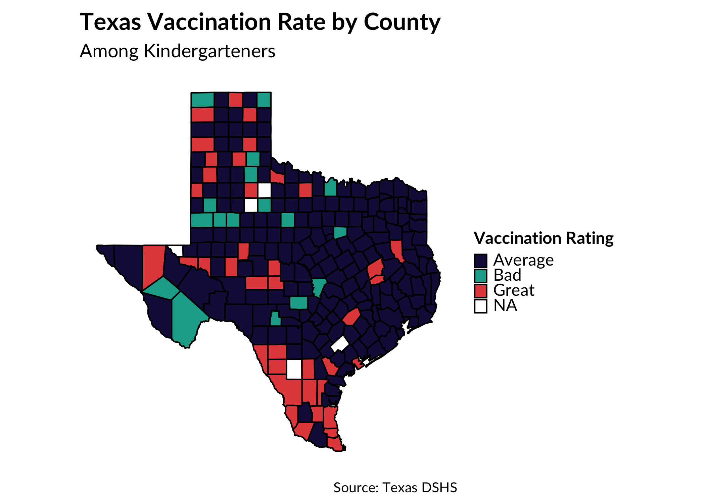

If the number of colors exceeds the number of colors in the TPL palette (9), the function `tpl_color_pal()` will drop the TPL color palette and return the greatest number of unique colors possible within the RColorBrewer’s “Paired” palette (for more information on the use of RColorBrewer palettes, see [this chapter](https://bookdown.org/rdpeng/exdata/plotting-and-color-in-r.html#using-the-rcolorbrewer-palettes)).

    tx_vac %>% 
      ggplot(mapping = aes(x = long, y = lat, group = group, fill = subregion)) +
      coord_fixed(1.3) +
      geom_polygon(color = "black", show.legend = FALSE) +
      labs(title = "Texas Counties")

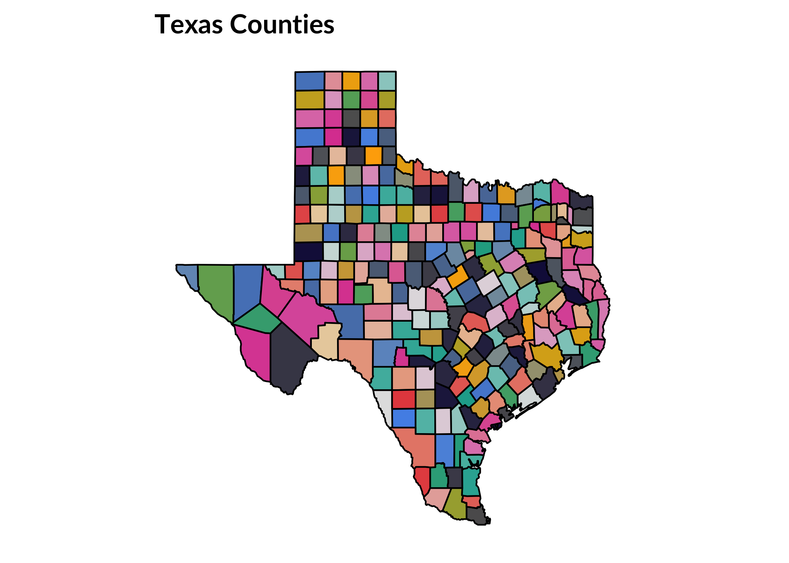

    # default to print afterwards
    set_tpl_theme(style = "print")

### TPL Branding

#### Logo

The user also has the option to include the TPL logo in single plots. This may be preferred for those reports being made especially public, or to serve as a pseudo-watermark in proprietary plots.

The user can specify the `position` of the logo as well as its `scale`. The scale argument refers to the size of the logo object, with the specified number corresponding to a multiplication with the normal logo size. In other words, `scale = 2` will *double* the size of the logo. The logo defaults to 1/7th of the size of the plot.

    add_tpl_logo(tpl_plot_test(type = "barplot"), position = "top right", scale = 1.5)

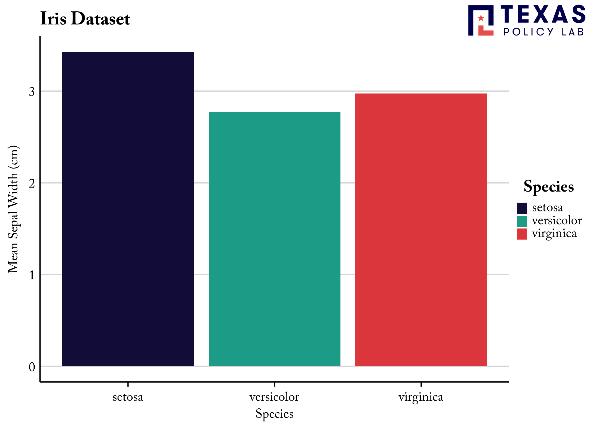

#### Logo Text

There may be some instances when an all-out logo is not warranted or preferred. If that is the case and the user would still like to watermark their figures, they can use the function `add_tpl_logo_text()` to add text to an existing plot object:

    plot <- ggplot(iris, aes(x=jitter(Sepal.Width), y=jitter(Sepal.Length), col=Species, size = Petal.Length)) +
        geom_point() +
        labs(x="Sepal Width (cm)", y="Sepal Length (cm)", col="Species", size = "Petal Length", title="Iris Dataset")
        
    add_tpl_logo_text(plot)

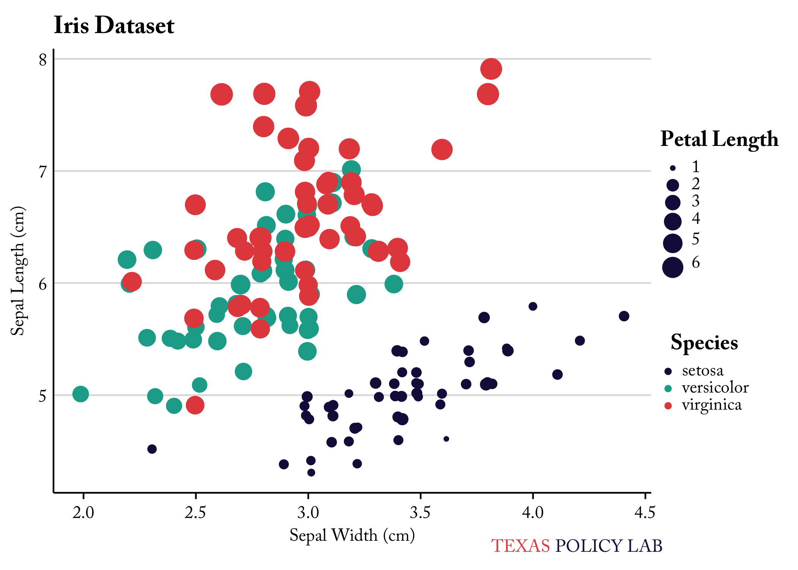

The user may also need to specify `align`, which moves the plot horizontally across the bottom of the page.

    plot <- ggplot(iris, aes(x=Species, y=Sepal.Width, fill=Species)) +
        geom_boxplot(show.legend = FALSE) +
        labs(x="Species", y="Sepal Width (cm)", fill="Species", title="Iris Dataset", subtitle ="When specifying align = 1")
        
    add_tpl_logo_text(plot, align = 1)    

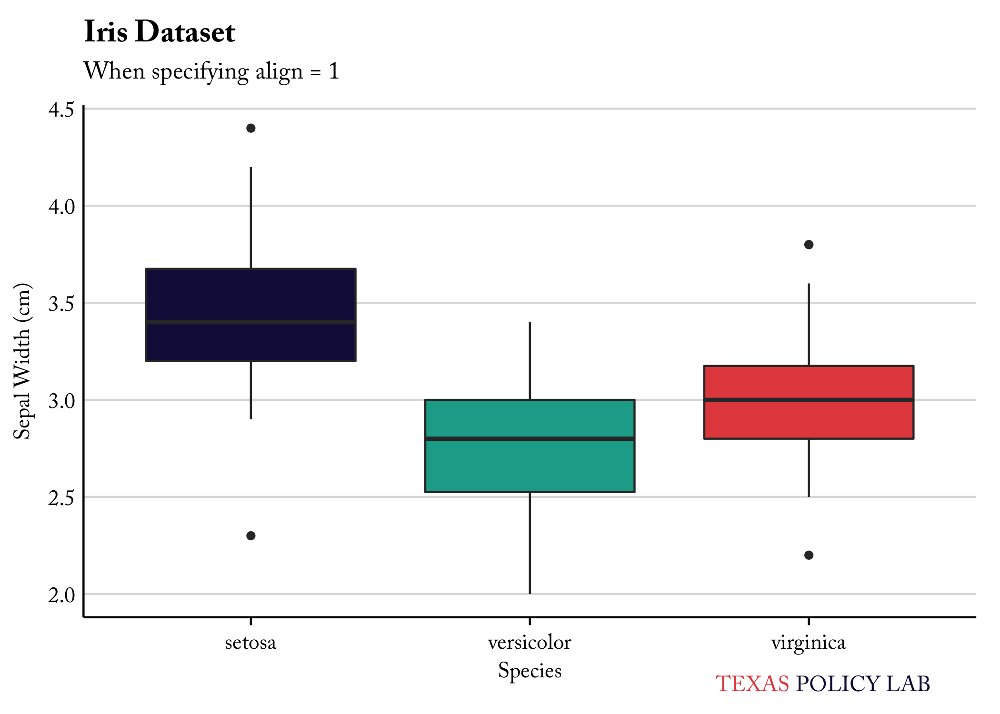

### Additional Functions

#### Drop Axes

In the event that the user wishes to drop an axis, they may do so with `drop_axis()`. The function may drop any combination of axes depending on the user’s input (`drop = "x"`, `drop = "y"`, `drop = "both"`, `drop = "neither"`).

Unlike `add_tpl_logo()`, `drop_axis()` should be *added* to an existing plot object:

    ggplot(iris, aes(x=jitter(Sepal.Width), y=jitter(Sepal.Length), col=Species, size = Petal.Length)) +
        geom_point() +
        labs(x="Sepal Width (cm)", y="Sepal Length (cm)", col="Species", size = "Petal Length", title="Iris Dataset") +
        drop_axis(axis = "y")

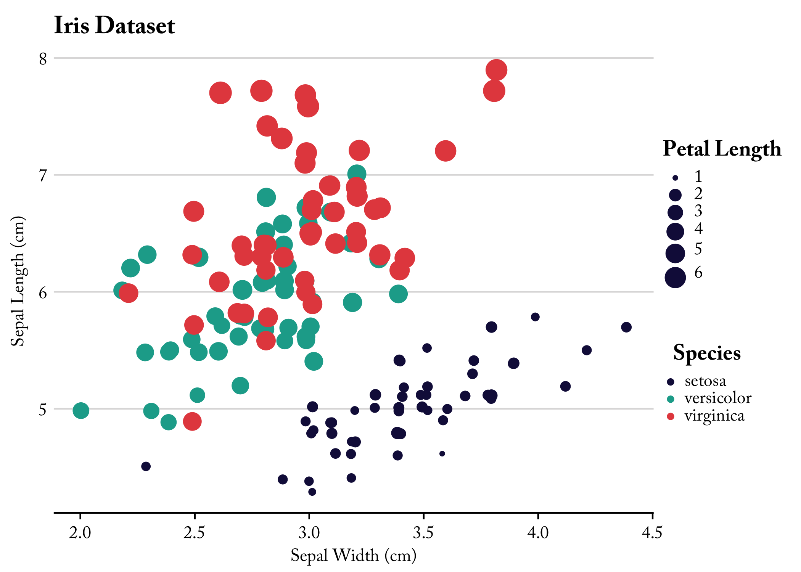

#### Color Palettes

The function `view_palette` plots base color palettes included in `tpltheme`. All TPL color palettes are led by the notation `palette_tpl_*` and therefore can be easily autocompleted within RStudio.

    p1 <- view_palette(palette = palette_tpl_main) + ggtitle("Categorical")
    p2 <- view_palette(palette = palette_tpl_diverging) + ggtitle("Diverging")
    p3 <- view_palette(palette = palette_tpl_sequential) + ggtitle("Sequential")

    gridExtra::grid.arrange(p1, p2, p3, nrow = 1)

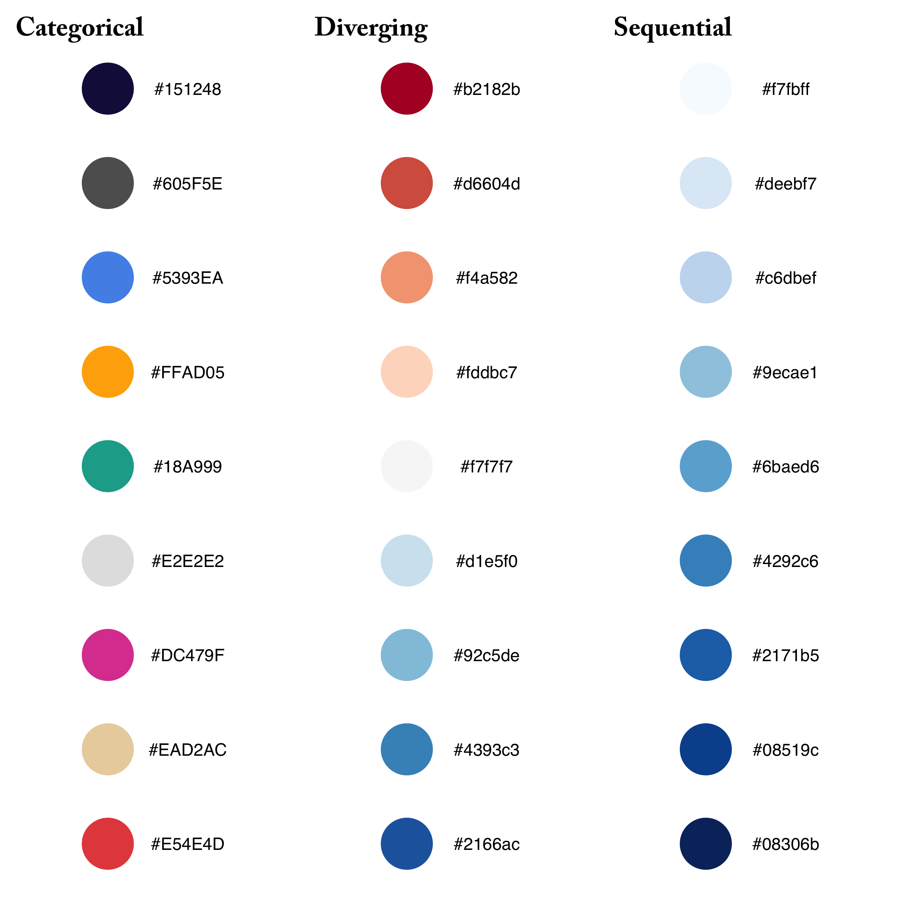

These palettes were created using <a href="http://colorbrewer2.org" class="uri">http://colorbrewer2.org</a> and <a href="http://coloors.co" class="uri">http://coloors.co</a> and are colorblind friendly.

The user may specify the color palette in the `scale_fill_*` or `scale_color_*` functions in a ggplot call. Specifically, the user can specify the `palette` (categorical, diverging, sequential) and whether the palette should be reversed.

    set_tpl_theme(style = "print", font = "lato")
    normal <- ggplot(diamonds) +
      geom_bar(aes(x = cut, fill = clarity)) +
      labs(title = "TPL Color Palette",
           subtitle = "On sample data",
           x = "Cut",
           y = "Count",
           fill = "Clarity") +
      theme(axis.text.x = element_text(angle = 45, hjust = 1))

    reversed <- normal +
      labs(subtitle = "(reversed)") +
      scale_fill_discrete(reverse = TRUE)

    gridExtra::grid.arrange(normal, reversed, nrow = 1)

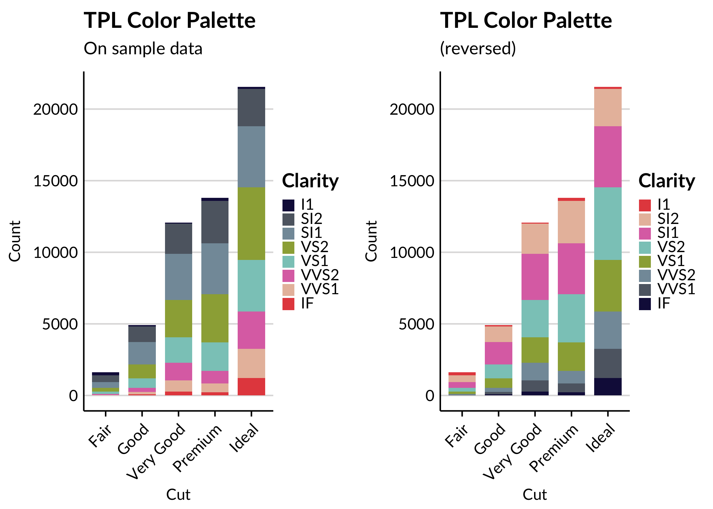

    normal <- diamonds %>% 
      group_by(clarity) %>% 
      summarise(price = mean(price)) %>% 
      mutate(clarity = forcats::fct_reorder(clarity, price)) %>% 
      ggplot() +
      geom_col(aes(x = clarity, y = price, fill = clarity), show.legend = FALSE) +
      labs(title = "TPL Color Palette",
           subtitle = "in action",
           x = "Clarity",
           y = "Price",
           fill = element_blank()) +
      theme(axis.text.x = element_text(angle = 45, hjust = 1)) +
      coord_flip() +
      scale_fill_discrete() +
      scale_y_continuous(expand = expand_scale(mult = c(0, 0.001))) +
      drop_axis(axis = "x")

    reversed <- normal +
      labs(subtitle = "(reversed)") +
      scale_fill_discrete(reverse = TRUE)

    gridExtra::grid.arrange(normal, reversed)

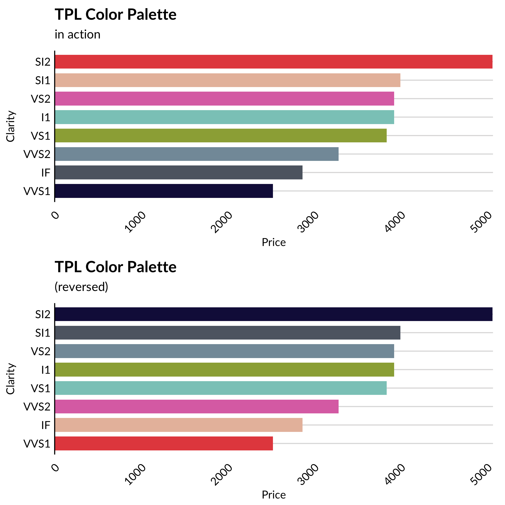

    data <- gapminder::gapminder %>% 
      dplyr::filter(gapminder::gapminder$country %in% c("France", "Germany", "Ireland", "Italy", "Japan", "Norway", "Mexico", "United States")) %>%
      dplyr::mutate(year = as.Date(paste(year, "-01-01", sep = "", format='%Y-%b-%d')))

    ggplot(data = data, aes(x = year, y = gdpPercap, fill = country)) +
      geom_area(alpha = 0.8) +
      scale_x_date(expand = c(0,0)) +
      scale_y_continuous(expand = c(0, 0), labels = scales::dollar) +
      labs(title = "GDP Per Capita Over Time",
           subtitle = "Using the TPL Color Palette",
           x = element_blank(),
           y = "GDP Per Capita",
           fill = "Country") + 
      theme(axis.text.x = element_text(angle = 45, hjust = 1))

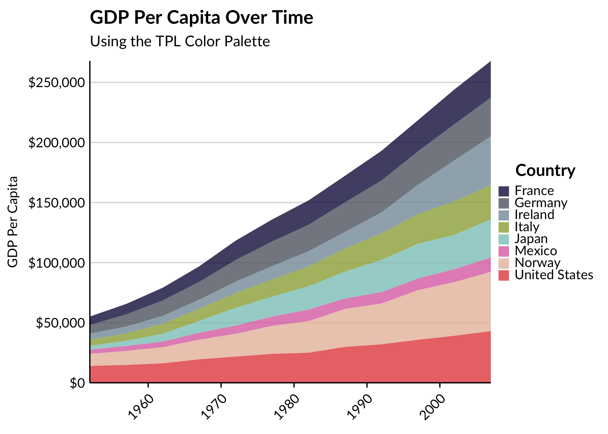

#### Restore Defaults

By calling `undo_tpl_theme`, you are able to remove TPL-specific theme settings and restores to ggplot defaults.

    undo_tpl_theme()
    #> [1] "All TPL defaults were removed and the tplthemes package has been effectively detached from the current environment. To restore TPL defaults, use set_tpl_theme()."
    ggplot(iris, aes(x=jitter(Sepal.Width), y=jitter(Sepal.Length), col=Species, size = Petal.Length)) +
        geom_point() +
        labs(x="Sepal Width (cm)", y="Sepal Length (cm)", col="Species", size = "Petal Length", title="Iris Dataset")

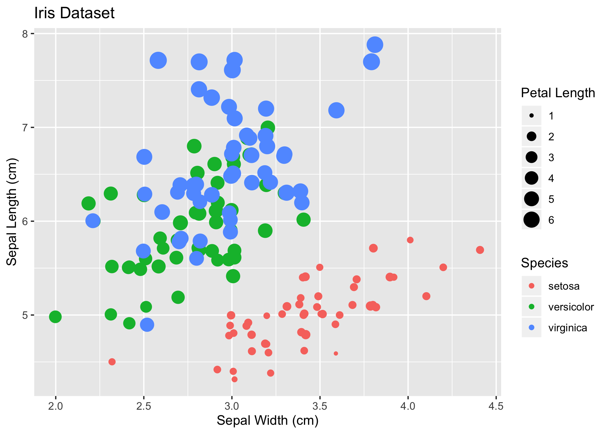

To restore the TPL theme, simply call `set_tpl_theme()`:

    set_tpl_theme()
    last_plot()

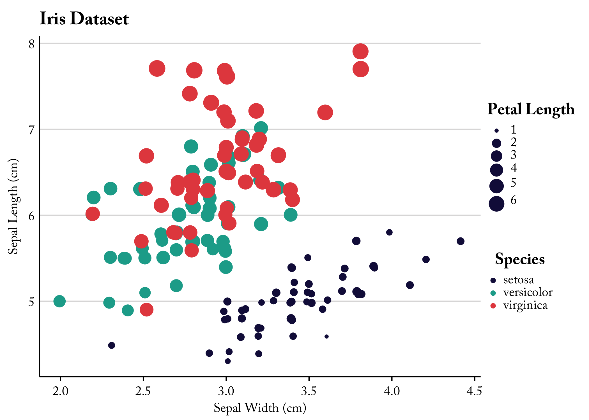

Reporting
---------

-   `read_word`: Reads word into Rmarkdown, such that word documents can be edited and read into the main Rmarkdown file for creating reports.
-   `read_word_table`: Reads a table from word into Rmarkdown, such that tables in word can be edited and then imported into Rmarkdown.
